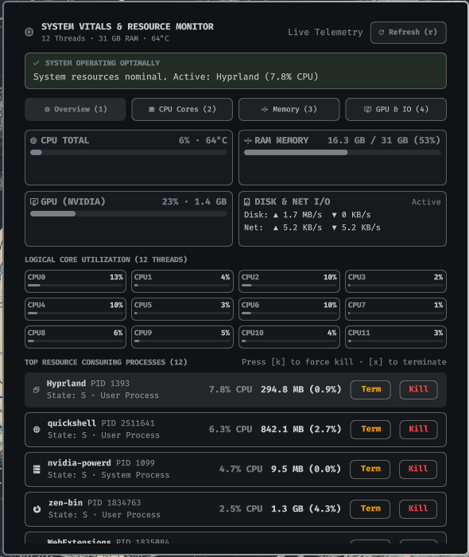

# OmaPulse

Real-time hardware vitals, per-core CPU load, memory breakdown, GPU compute & VRAM telemetry, network/disk I/O rates, and one-click process triage for the Omarchy Quattro Desktop Shell.



## Highlights

- Real-Time Hardware Telemetry: Unprivileged polling of overall CPU, 12-thread per-core utilization meters, RAM and Swap metrics, CPU package thermals, and GPU stats.
- Multi-GPU Support: Automatic telemetry detection for NVIDIA GeForce / RTX GPUs via nvidia-smi with integrated Intel and AMD sysfs fallbacks.
- One-Click Process Triage: Interactive top resource consuming process list with polite Term (SIGTERM) and force Kill (SIGKILL) actions.
- Dynamic Alert System: Top bar icon shifts dynamically from optimal theme accent to amber or red when system resources face genuine exhaustion or thermal throttling limits.
- Non-Intrusive & Fast: Fully unprivileged execution with zero elevated permissions required. Reads standard Linux /proc and /sys telemetry collection taking less than 0.01% CPU.

## Installation

Install directly via the Omarchy plugin package manager:

```bash
omaplug install kiryuuki.oma-pulse
```

Then enable `kiryuuki.oma-pulse` in your `~/.config/omarchy/shell.json` widgets array.

## Keyboard Shortcuts

| Shortcut | Action |
|---|---|
| `1` | Switch to Overview tab |
| `2` | Switch to CPU & Cores tab |
| `3` | Switch to Memory tab |
| `4` | Switch to GPU & IO tab |
| `j` / `Down` | Select next process in triage list |
| `k` / `Up` | Select previous process in triage list |
| `x` | Send polite SIGTERM to selected process |
| `k` | Send force SIGKILL to selected process |
| `r` | Trigger instant telemetry refresh |
| `Esc` | Close flyout panel |

## License

PolyForm Noncommercial License 1.0.0 (PolyForm-Noncommercial-1.0.0)
