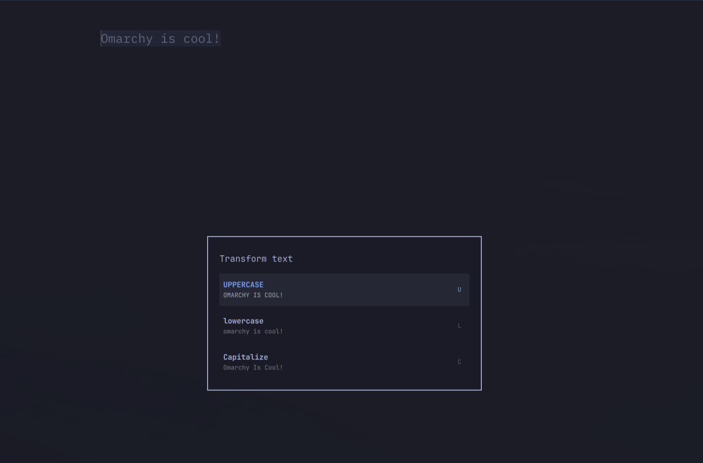

# Text Transform

An [Omarchy](https://omarchy.org/) shell plugin that transforms the text you
have highlighted and replaces it in place. Highlight any text, press your
keybind, pick **Uppercase**, **Lowercase**, or **Capitalize**, and the
selection is rewritten — no copy–paste bookkeeping.



## Features

- Three case transformations on the highlighted text:
  - **Uppercase** — `everything UPPER`
  - **Lowercase** — `everything LOWER`
  - **Capitalize** — `Every Word In Title Case` (first letter of each word
    uppercase, the rest lowercase; apostrophes like `don't` stay intact)
- Reads the **primary selection** (the live highlight) with the clipboard as a
  fallback, so it works across GTK/Qt apps, editors, and terminals.
- Replaces the selection **in place** by typing over it, leaving your clipboard
  untouched — or paste with Shift+Insert / copy only, if you prefer.
- Correct Unicode case folding (accents, umlauts, non-Latin scripts) via a
  small Python helper.
- Theme-aware overlay that follows Omarchy's menu surface colors.

## Requirements

- Omarchy shell (Quickshell) — this is a first-party manifest plugin
- `wl-clipboard` (`wl-paste`, `wl-copy`)
- `wtype`
- `python3` (for Unicode-safe case conversion)
- `omarchy-notification-send` (falls back to `notify-send`)

All of the above ship with Omarchy by default.

## Installation

From a git URL (recommended):

```bash
omarchy plugin add https://github.com/TheRock892/text-transform --enable
```

Or copy the folder into the user plugins directory and enable it:

```bash
cp -r text-transform ~/.config/omarchy/plugins/text-transform
omarchy plugin enable text-transform
```

Enable only if you skipped `--enable`:

```bash
omarchy plugin enable text-transform
```

The plugin id is `text-transform`; change the `id` field in `manifest.json`
to your own `author.plugin` namespace if you publish it.

## Removal

```bash
omarchy plugin remove text-transform
```

Or disable it without removing the files:

```bash
omarchy plugin disable text-transform
```

## Usage

### With the picker (recommended)

Bind a key in `~/.config/hypr/bindings.lua`:

```lua
o.bind("SUPER + U", "Transform text", "omarchy-shell shell toggle text-transform")
```

Then highlight some text in any application and press
`SUPER + U`. A small picker opens:

1. n**U**p / Down / mouse hover to choose a mode, Enter to apply;
2. or press **U**, **L**, **C** for Uppercase, Lowercase, Capitalize;
3. `Esc` cancels.

### Without the picker

Bind the three operations directly — handy when you only ever use one mode:

```lua
o.bind("SUPER + SHIFT + U", nil, "text-transform upcase")
o.bind("SUPER + SHIFT + L", nil, "text-transform downcase")
o.bind("SUPER + SHIFT + C", nil, "text-transform capitalize")
```

## CLI

```
text-transform [--shift-insert] [--copy-only] <upcase|downcase|capitalize>
text-transform --get-selection
```

The command reads the highlighted text (primary selection, clipboard as a
fallback), transforms it, copies the result to the clipboard (convenient side
effect), and replaces the selection by typing it over the highlight.

| Option | Behaviour |
| --- | --- |
| *(none)* | Type the transformed text over the selection |
| `--shift-insert` | Paste the result with Shift+Insert instead of typing |
| `--copy-only` | Put the result on the clipboard and stop |
| `--get-selection` | Print the current selection and exit |

Run `text-transform --help` for the full help text.

## How it works

1. The overlay's preview is fed by `bin/text-transform --get-selection`,
   which reads the primary selection via `wl-paste --primary` and falls back
   to the clipboard.
2. Picking a mode dismisses the overlay and runs `bin/text-transform <mode>`.
   The script re-reads the selection, converts it with
   `bin/text-transform.py`, copies the result with `wl-copy`, waits
   ~150 ms for the shell to hand focus back, then types it out with `wtype`.
   Because the text is still selected, the app replaces the highlight with the
   typed text.
3. Empty selections produce a desktop notification instead of a silent no-op.
4. Selections are capped at 64 KiB and each helper process (`wl-paste`,
   `python3`, `wl-copy`, `wtype`) has a 2-second deadline, so an oversized or
   stuck clipboard producer can't hang the picker or balloon memory.

## Development

```bash
omarchy plugin validate .   # manifest + entry-point checks
./tests/run.sh              # transform and CLI tests
```

Edit any file under the plugin folder and, once installed, the shell
hot-reloads it on save (`omarchy-shell shell rescanPlugins` if needed).

## License

[MIT](LICENSE)